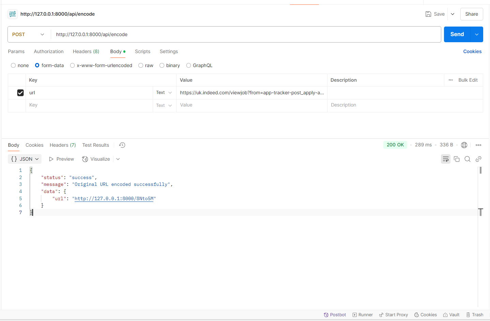
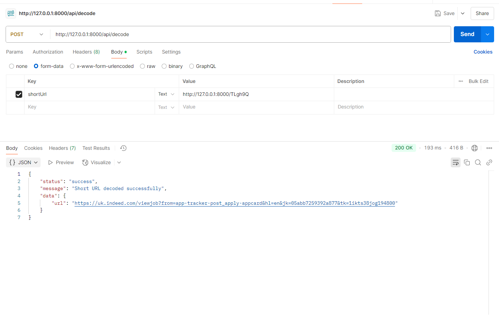

# URL Shortener Service

## Project Description
This is a simple URL shortening service implemented using Laravel 12. It allows you to shorten long URLs by sending a POST request with the URL to `/api/encode` endpoint and retrieve the original URL by sending a POST request with the short URL to `/api/decode` endpoint. The short URLs are temporarily stored in the cache and are not persisted in a database.

## Features
- **URL Encoding** - Convert long URLs into short, easily shareable links.
- **URL Decoding** - Retrieve the original URL from a short link.
- **In-Memory Storage** - Uses Laravel's caching system for fast lookup.
- **RESTful API** - Fully structured JSON API responses.
- **Validation & Error Handling** - Proper input validation with meaningful error messages.
- **Comprehensive Test Coverage** - Ensures API reliability with feature tests.


## System Architecture
The service follows a **stateless RESTful API design**. It utilizes Laravel's caching system for temporary storage, making it highly performant without requiring database persistence.

## Requirements

- PHP 8.2 or higher
- Composer
- Laravel 12

## Setup & Installation

#### Installation Steps
 Run the following in the application directory:
   ```sh
   composer install
```

#### Copy .env.example to .env
```sh
cp .env.example .env
```
#### Generate Laravel application key
```sh
php artisan key:generate
```

#### Start the application server
 Run the following command:
   ```sh
   php artisan serve
```
Your application should be running on http://127.0.0.1:8000/ depend on your port availability

#### Run test
 Unit tests have been added to cover all functionality. Run tests using:
   ```sh
   php artisan test --filter=UrlShortenerTest
```

### API Endpoints

- `POST /api/encode`     - To encode original url to short url
- `POST /api/decode`     -  To decode short url to original url

 If the API endpoints are not accessible, run the following command:
   ```sh
   composer dump-autoload
   php artisan route:clear
   php artisan route:cache
```

### Storage Mechanism:
- Encoded URLs are stored in Laravel’s **cache** using a unique hash.
- URLs are persisted **in-memory** for fast retrieval.
- URLs expire after a certain period.

### Future Improvements
- Implement Laravel Middleware Throttle for Rate Limiting.
- Implement Laravel Passport/Sanctum for Authentication.
- Implement Laravel Gate and Policy for Access Control
- Implement Database for scalability
- Implement API Versioning using middleware in route
- and more

### Encoding Original URL

### Decoding Shortened URL
